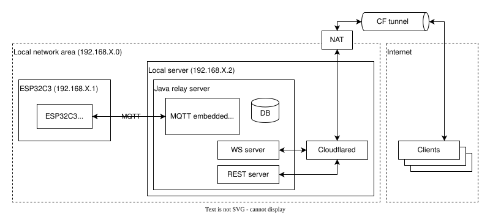
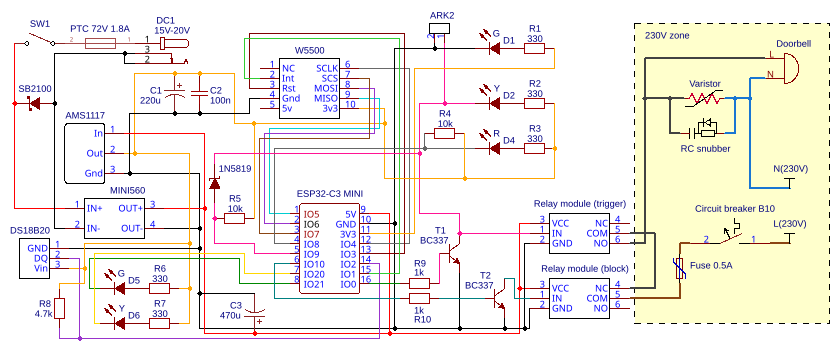

# Intelligent doorbell system

This ESP32-C3 and W5500 Ethernet doorbell uses BC337 transistors in a Wired-OR setup to integrate a physical button with
digital logic. Two relays manage a 230V bell for triggering and silent mode blocking, while the hardware configuration
enables manual operation during an ESP32 system hang. Data travels via MQTT and Cloudflare Tunnel to a Java backend and
multiplatform mobile/desktop apps, supported by single-click OTA updates.

* **Installation & provisioning:** See [INSTALL](./INSTALL.md) for instructions on how to flash and set up the device.
* **Development:** See [CONTRIBUTING](./CONTRIBUTING.md) for setting up the environment and building artifacts.

## Table of content

* [System infrastructure](#system-infrastructure)
* [Hardware](#hardware)
* [Software](#software)
* [Hardware and software stack](#hardware-and-software-stack)
* [Author](#author)
* [License](#license)

## System infrastructure

The client communicates with the local network via a secure tunnel (WSS), eliminating the need for a public IP address
and NAT rule configuration on the edge firewall. External traffic is received by a daemon on the edge server and routed
to a containerized intermediary node (Relay Server). This internal service manages the asynchronous message exchange
with a local MQTT broker. The IoT endpoint maintains a persistent TCP session with the broker, subscribing to command
topics and publishing its operational status. Ultimately, the microcontroller translates the received network packets
into physical logical state changes on GPIO pins, directly driving the relay module. Isolating the Relay Server as an
independent component enables the delegation of business logic, database persistence, and telemetry archiving outside
the embedded layer.

## Hardware

[Click to open schematic in PDF format](.github/schematic/esp32c3-driver.pdf)

[TBD]

### Standalone unit (boxed)

[TBD]

### Prototype with test bench

[TBD]

## Software

### ESP32C3 firmware

[TBD]

### Java relay server with embed MQTT broker and mDNS

[TBD]

### Multi-platform client

[TBD]

### Provisioning tool (ESP32C3 flashing)

[TBD]

## Hardware and software stack

[TBD]

## Author

Created by Miłosz Gilga. If you have any questions about this project, send message:
[miloszgilga@gmail.com](mailto:miloszgilga@gmail.com).

## License

This project is licensed under the GNU General Public License v3.0.
